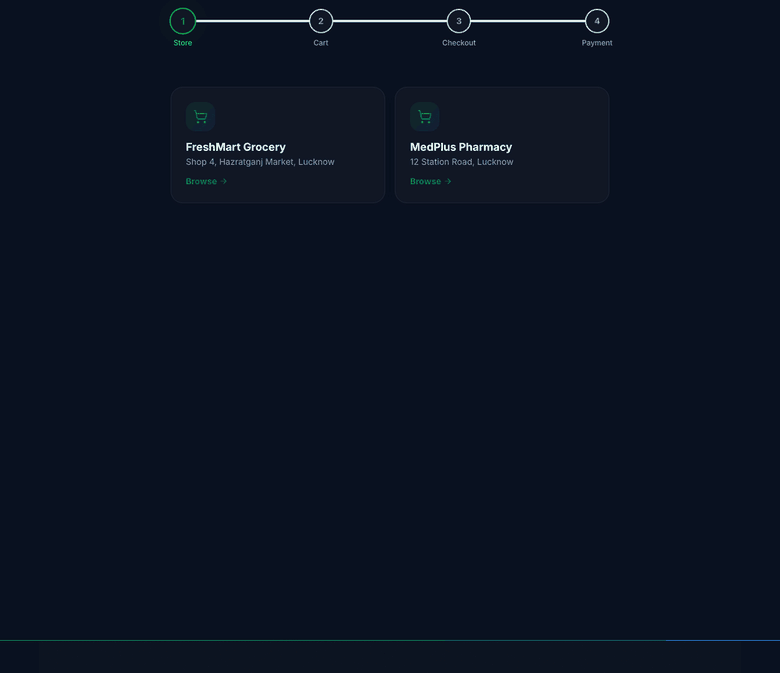
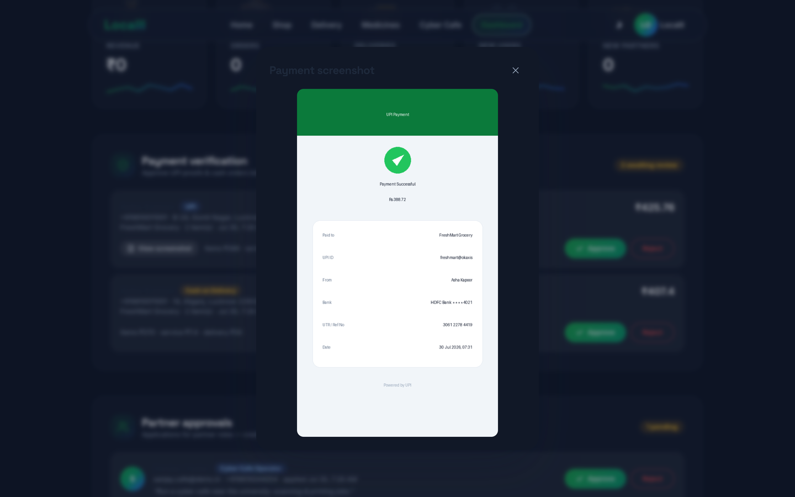
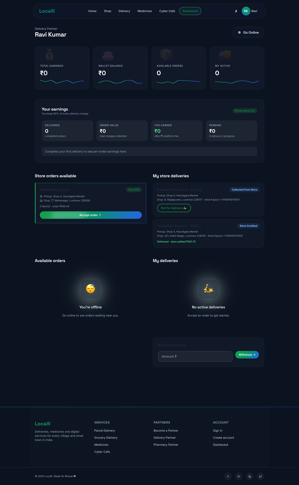
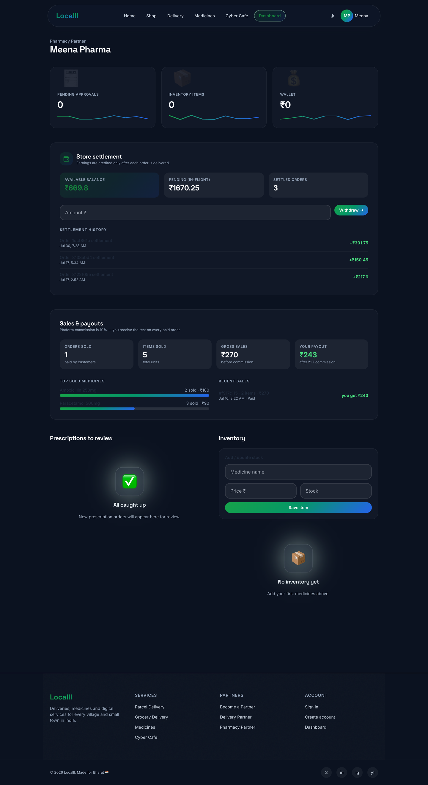

<div align="center">

# 🏘️ Localll - Backend

### Hyperlocal deliveries, medicines, store orders & cyber-cafe services - as an event-driven microservices platform.


<br/>


</div>

---

Localll is a **Dunzo/Porter-style hyperlocal platform** for Indian towns and villages: parcel & grocery delivery, online medicines, local store orders with manual UPI payments, and cyber-cafe services - all handled by trusted people from the same town.

This repository is the **backend**: eleven independently deployable .NET 9 services behind a single YARP gateway, each owning its own PostgreSQL database and talking to the others **only through RabbitMQ events**. The Angular frontend lives in a separate repo - [**Localll_Frontend**](https://github.com/ojas2005/Localll_Frontend).

> 📐 **Full diagrams** (HLD, LLD, per-service ER) → [`docs/ARCHITECTURE.md`](docs/ARCHITECTURE.md) - rendered natively on GitHub with Mermaid.

<br/>

## ✨ What these services power

The screenshots below are the **frontend flows** - each one is backed by the services and guarantees described in this repo.

### The flagship: manual UPI payment → delivery → store settlement

A customer builds a cart, pays by UPI (or COD), and **uploads a payment screenshot** - the `StoreOrders` service holds the order until an admin verifies the proof, then races it out to delivery partners.

<div align="center">

<br/><em>Customer checkout - the order stays <code>PendingPaymentVerification</code> until the uploaded proof is approved.</em>
</div>

<table>
<tr>
<td width="50%" valign="top">

**Admin verifies the uploaded proof**

<sub>`POST /store/admin/orders/{id}/review` → approve emits an event; reject notifies the customer.</sub>

</td>
<td width="50%" valign="top">

**Partner claims it (first-come, race-safe)**

<sub>A single conditional `UPDATE … WHERE Status=Waiting AND PartnerId IS NULL` - no double assignment.</sub>

</td>
</tr>
</table>

<div align="center">

<br/><em>The store wallet is credited <strong>only after delivery</strong> - an append-only ledger, idempotent by <code>ReferenceId</code>.</em>
</div>

<br/>

## 🧱 Architecture

```
Angular client  →  Gateway (YARP :8080)  →  11 services (one DB each)
                    JWT · rate limit · CORS         │
                    · compression                   ├─ integration events →  RabbitMQ (MassTransit)
                                                     └─ PostgreSQL (DB-per-service) · Redis (OTP, cache, live location)
```

- **Database-per-service** - no service reads another's tables. Cross-service links are IDs carried in events, never SQL joins.
- **Shared building blocks** - `Localll.Common` wires Serilog, JWT bearer auth, Swagger, FluentValidation, OpenTelemetry (OTLP), health checks, Redis and MassTransit identically for every service via `AddPlatform()`.
- **Event choreography, no orchestrator** - each service reacts to events. A delivery order: `OrderCreatedEvent` → Partner feed → partner accepts (atomic claim) → `OrderAcceptedEvent` → OTP handover → `DeliveryCompletedEvent` → Wallet credits the partner 80% (idempotent) → `WalletUpdatedEvent`; Notification & Analytics react to everything.
- **At-least-once delivery, so every consumer is idempotent** - a state check or a `ReferenceId` guard turns replays into no-ops.

## 🧩 Services

| Service | Port | Responsibilities |
|---|---|---|
| **Gateway** | 8080 | Routing, JWT at the edge, rate limiting, CORS, gzip |
| **Identity** | 5001 | Register, login, JWT + rotating refresh tokens, OTP, password reset, lockout |
| **User** | 5002 | Profiles (auto-created from `UserRegisteredEvent`), addresses, reviews |
| **Delivery** | 5003 | Parcel/grocery orders, weight+distance pricing, OTP completion, tracking |
| **Medicine** | 5004 | Catalog search (cached), prescription orders, pharmacist approval |
| **Payment** | 5005 | Idempotent payments (`Idempotency-Key` header), refunds |
| **Wallet** | 5006 | Append-only ledger, delivery earnings credits, withdrawals |
| **Notification** | 5007 | Email/SMS/Push/WhatsApp consumers (mock providers in dev) - stateless |
| **CyberCafe** | 5008 | Appointments, operator assignment, session & file metadata |
| **Partner** | 5009 | Partner onboarding, order feed with atomic claim, inventory, live location (Redis, 60s TTL) |
| **Analytics** | 5010 | Daily metric rollups from events, admin dashboards |
| **StoreOrders** | 5011 | Manual UPI/COD payments, screenshot verification, first-come assignment, store settlement |

## 🔒 Concurrency & integrity (the interesting bits)

- **First-come-first-served, no duplicates** - partners race to accept; the winner is decided by one atomic conditional `UPDATE`. Losers get a clean `409`, no row locks, no distributed transaction.
- **Money is never credited early** - a store's wallet is settled **only** inside the `Delivered` transition, after which status becomes `StoreCredited`. Commission (15%) and delivery charge are deducted at that point.
- **Idempotent everywhere** - wallet credits are keyed by `ReferenceId`; payments by `Idempotency-Key`; event consumers re-check state before acting.

## 🚀 Running locally

Prerequisites: **.NET 9 SDK**, **Docker**, **Node 20+** (for the frontend).

```bash
# 1. Infrastructure (Postgres :5433, Redis :6381, RabbitMQ :5674 / UI :15674)
docker compose up -d postgres redis rabbitmq

# 2. Run any service (schema is created automatically on startup)
dotnet run --project src/Services/Identity/Localll.Identity.API
dotnet run --project src/Gateway/Localll.Gateway

# 3. …or the whole stack in containers
docker compose up -d --build
```

Swagger UI is at `/swagger` on each service in Development. RabbitMQ management: http://localhost:15674 (`localll` / `localll_dev_password`).

> Ports differ from the image defaults because other projects on this machine already held 5432 / 5672. Postgres → host **5433**, RabbitMQ AMQP → **5674**, UI → **15674**. `guest`/`guest` is intentionally avoided (RabbitMQ restricts it to loopback, which fails under Docker Desktop's port proxy) - a real `localll` account is provisioned instead.

### Try it

```bash
# Register (emits UserRegisteredEvent → profile + wallet created)
curl -X POST http://localhost:8080/api/v1/auth/register \
  -H 'Content-Type: application/json' \
  -d '{"email":"me@example.com","phoneNumber":"+919876543210","fullName":"Me","password":"Passw0rd123"}'

# Delivery quote (base ₹30 + distance + weight)
curl -X POST http://localhost:8080/api/v1/deliveries/quote \
  -H "Authorization: Bearer $TOKEN" -H 'Content-Type: application/json' \
  -d '{"orderType":"Parcel","distanceKm":5,"weightKg":2}'
```

## 🧪 Tests

```bash
dotnet test Localll.slnx
```

Unit tests cover the delivery pricing engine and wallet ledger invariants (insufficient balance, running balance, immutable entries).

## 🗂️ Repository layout

```
src/
  BuildingBlocks/
    Localll.SharedKernel/   # Entity, AggregateRoot, Result, PagedResult
    Localll.Contracts/      # integration events - the only cross-service contract
    Localll.Common/         # platform wiring shared by every service (AddPlatform)
  Gateway/Localll.Gateway/  # YARP reverse proxy
  Services/<Name>/Localll.<Name>.API/
    Domain/    Data/    Features/    Consumers/
infrastructure/docker/      # shared Dockerfile + Postgres multi-DB init
docs/ARCHITECTURE.md        # HLD · LLD · ER diagrams (Mermaid)
tests/UnitTests/
.github/workflows/ci.yml    # build → test → per-service Docker images
```

## 🛡️ Security notes

- Passwords hashed with **bcrypt**; refresh tokens rotate on use and are revoked on password reset.
- Account lockout after 5 failed logins; password-reset never reveals whether an email exists.
- OTPs live only in Redis with a TTL; payments require an `Idempotency-Key`.
- Role-based authorization (`Customer`, `DeliveryPartner`, `PharmacyPartner`, `CyberCafeOperator`, `Admin`) enforced per endpoint - JWT validated at the gateway **and** in every service.
- **Signing keys & DB passwords in `appsettings.json`/compose are dev-only** - inject real secrets via environment variables or a vault in production, and switch `EnsureCreated` to EF migrations for CI/CD.

## 🗺️ Roadmap (from the PRD)

Kubernetes/Helm manifests · Elasticsearch/Kibana log shipping · Prometheus/Grafana (OTLP is already wired) · SignalR live tracking · object-storage presigned uploads · saga/outbox patterns · AI features.

<div align="center">
<br/>
<sub>Frontend → <a href="https://github.com/ojas2005/Localll_Frontend">Localll_Frontend</a> &nbsp;·&nbsp; Architecture diagrams → <a href="docs/ARCHITECTURE.md">docs/ARCHITECTURE.md</a></sub>
</div>
