# Localll Backend — Architecture Diagrams

HLD · LLD · per-service ER diagrams | .NET 9 microservices · PostgreSQL (DB-per-service) · Redis · RabbitMQ (MassTransit) · YARP

## Contents

**HLD**
- [1. System architecture](#1-system-architecture-hld)
- [2. Event choreography](#2-event-choreography-async-message-flow-hld)

**LLD**
- [3. Service internal anatomy](#3-service-internal-anatomy-layers-lld)
- [4. Request lifecycle & middleware pipeline](#4-request-lifecycle--middleware-pipeline-lld)
- [5. Sequence: delivery completion & wallet settlement](#5-sequence--delivery-completion--wallet-settlement-lld)
- [6. Cross-service data ownership map](#6-cross-service-data-ownership-map-lld)

**ER**
- [Identity](#identity-db--er) · [User](#user-db--er) · [Delivery](#delivery-db--er) · [Medicine](#medicine-db--er) · [Payment](#payment-db--er) · [Wallet](#wallet-db--er) · [StoreOrders](#storeorders-db--er) · [Partner](#partner-db--er) · [CyberCafe](#cybercafe-db--er) · [Analytics](#analytics-db--er)

---

## 1. System architecture (HLD)

Every request enters through the YARP gateway. Each service owns its own PostgreSQL database and communicates with others only via RabbitMQ integration events. Redis is shared for OTPs, caching and live location.

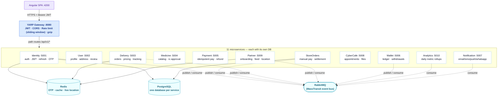

Solid arrows = synchronous HTTP through the gateway. Dashed arrows = asynchronous events on RabbitMQ. JWT is validated **at the gateway and again inside each service** (defense in depth).

---

## 2. Event choreography (async message flow) (HLD)

There is no central orchestrator. Each service reacts to events. This is the end-to-end happy path from registration to a paid, delivered order that settles a wallet.

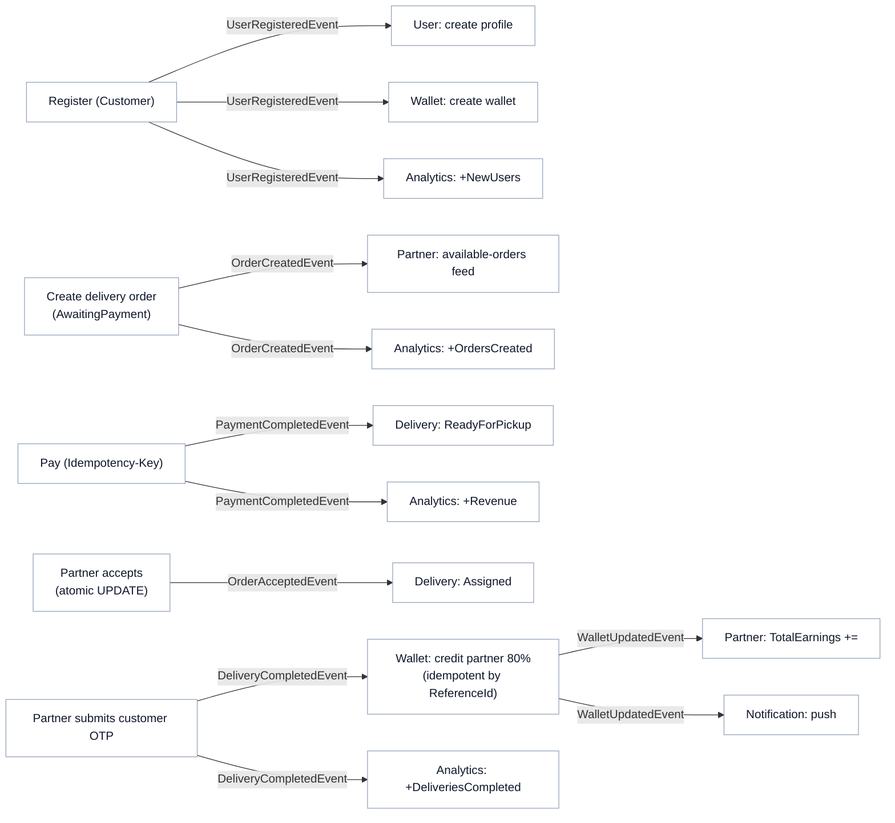

RabbitMQ delivery is **at-least-once**, so every consumer is idempotent (a state check or a `ReferenceId` guard makes replays a no-op).

---

## 3. Service internal anatomy (layers) (LLD)

Every service is built the same way. `AddPlatform()` from `Localll.Common` wires all cross-cutting concerns; the service only adds its DbContext, endpoints and consumers.

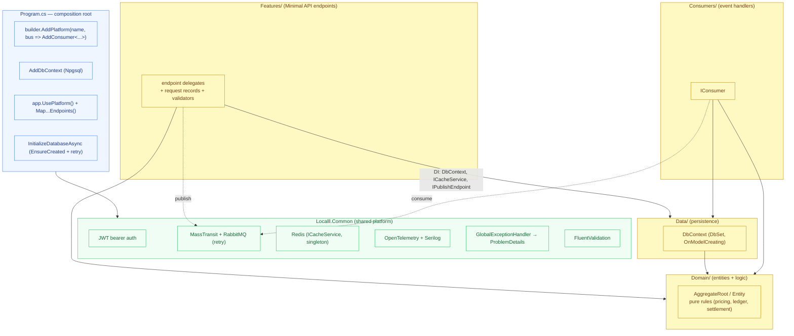

---

## 4. Request lifecycle & middleware pipeline (LLD)

The ordered pipeline fixed by `UsePlatform()`. Order matters: authentication must precede authorization, and the exception handler wraps everything downstream.

```mermaid
flowchart LR
  C["Client"] --> GW["Gateway: JWT · CORS · rate limit · gzip · route"]
  GW --> EXC["UseExceptionHandler"]
  EXC --> LOG["SerilogRequestLogging"]
  LOG --> AUTHN["UseAuthentication<br/>(populate HttpContext.User)"]
  AUTHN --> AUTHZ["UseAuthorization<br/>(RequireRole / policy)"]
  AUTHZ --> EP["Endpoint delegate"]
  EP --> V{"FluentValidation<br/>valid?"}
  V -- no --> P400["throw ValidationException<br/>→ 400 ProblemDetails"]
  V -- yes --> BL["Domain logic + DbContext"]
  BL --> SAVE["SaveChangesAsync"]
  SAVE --> PUB["publish integration event (optional)"]
  PUB --> RES["IResult (200/201/202/4xx)"]
  classDef m fill:#ffffff,stroke:#94a3b8,color:#0f172a;
  class C,GW,EXC,LOG,AUTHN,AUTHZ,EP,V,P400,BL,SAVE,PUB,RES m;
```

---

## 5. Sequence — delivery completion & wallet settlement (LLD)

The most instructive flow: OTP verification in Redis, a state transition in SQL, then an event that credits the partner exactly once.

```mermaid
sequenceDiagram
  autonumber
  actor P as Delivery Partner
  participant GW as Gateway
  participant D as Delivery svc
  participant RD as Redis
  participant DDB as Delivery DB
  participant MQ as RabbitMQ
  participant W as Wallet svc
  participant WDB as Wallet DB
  participant AN as Analytics
  participant NT as Notification

  P->>GW: POST /deliveries/{id}/complete { otp }
  GW->>D: forward (JWT valid, role=DeliveryPartner)
  D->>RD: GET delivery:otp:{id}
  RD-->>D: expected otp
  D->>D: compare otp; check status == PickedUp
  D->>DDB: status = Delivered
  D->>RD: DEL delivery:otp:{id}
  D->>MQ: publish DeliveryCompletedEvent (earning = 80%)
  D-->>P: 200 OK
  MQ-->>W: DeliveryCompletedEvent
  W->>WDB: exists ledger where ReferenceId == orderId ?
  alt already credited
    W-->>W: skip (idempotent)
  else first time
    W->>WDB: wallet.Credit(earning) + append LedgerEntry
    W->>MQ: publish WalletUpdatedEvent
  end
  MQ-->>AN: DeliveryCompletedEvent → +DeliveriesCompleted
  MQ-->>NT: WalletUpdatedEvent → push notification
```

---

## 6. Cross-service data ownership map (LLD)

There are **no foreign keys across services**. Services are linked only by IDs carried in events (dashed = logical reference via an ID, resolved through events/APIs, never a DB join).

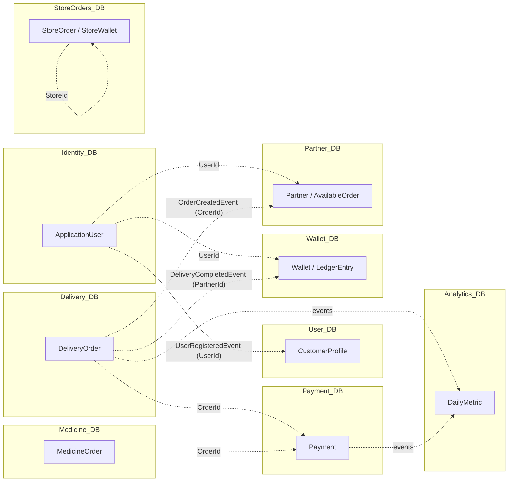

> **Interview point:** "How do two services share data without a join?" → They don't join. The owning service publishes an event carrying the ID; the consumer keeps its own copy of just what it needs (e.g. Partner's `AvailableOrder` is a projection of Delivery's order). Sharing tables would create a distributed monolith.

---

## Identity DB — ER

`IdentityDbContext` · one user has many rotating refresh tokens.

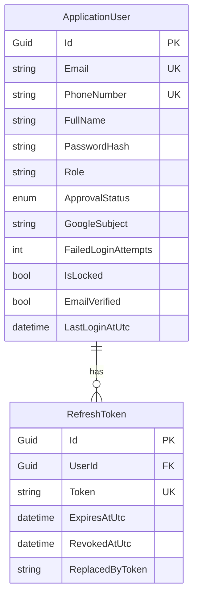

## User DB — ER

`UserDbContext` · profile has many addresses; reviews are standalone and indexed by (TargetType, TargetId).

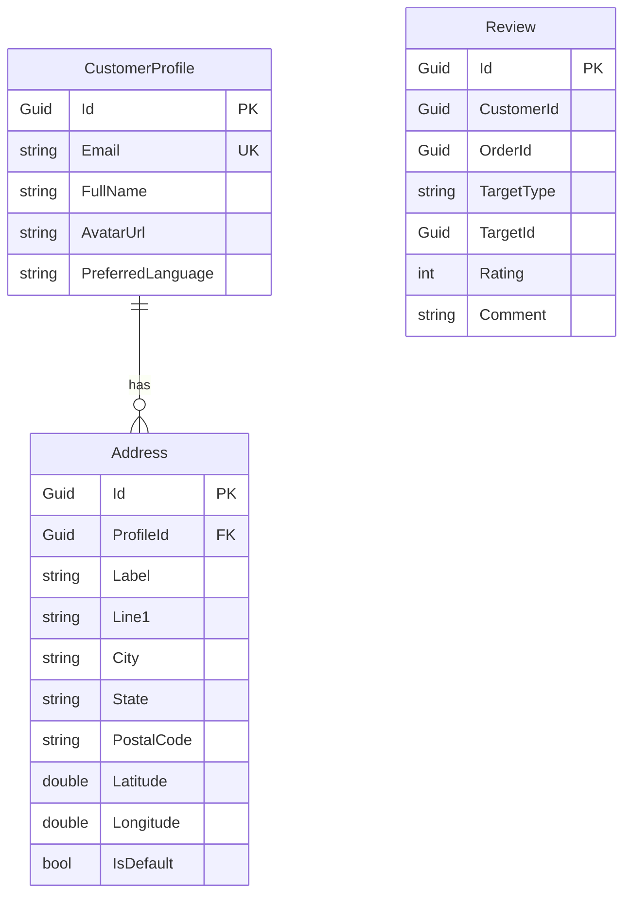

## Delivery DB — ER

`DeliveryDbContext` · TrackingEvent references an order by `OrderId` (logical, no hard FK); GroceryItem is an independent seeded catalog.

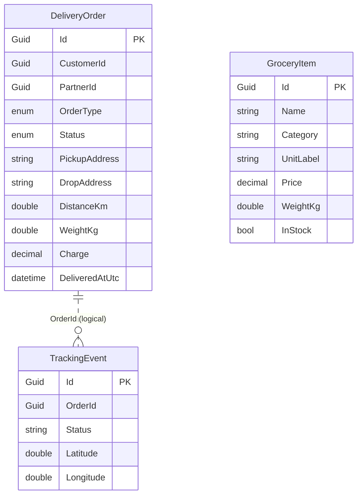

## Medicine DB — ER

`MedicineDbContext` · an order has many line items; Medicine is the seeded catalog referenced by `MedicineId`.

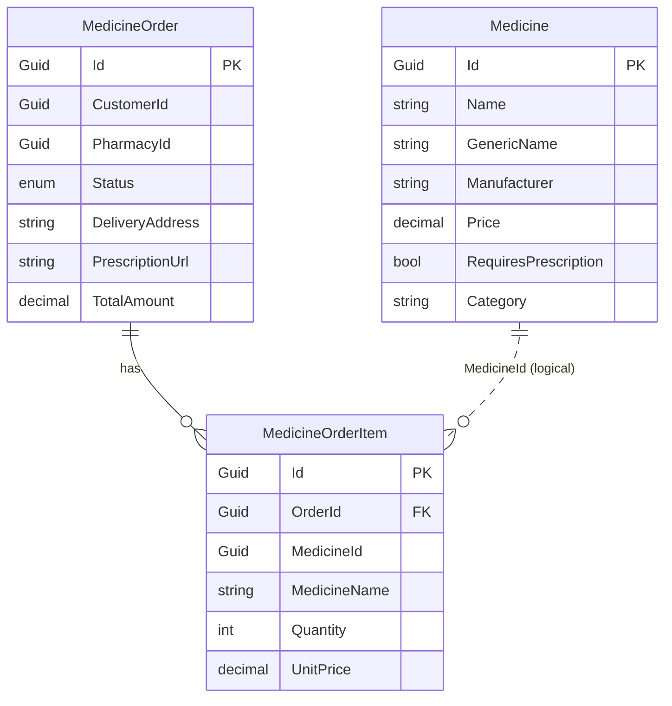

## Payment DB — ER

`PaymentDbContext` · single aggregate; `IdempotencyKey` is unique so retried requests can't double-charge.

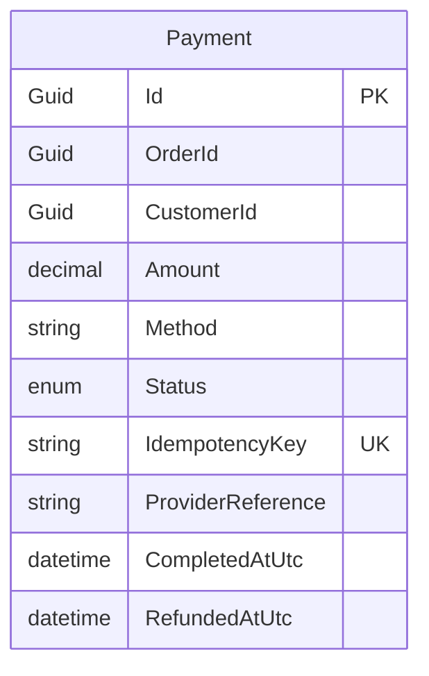

## Wallet DB — ER

`WalletDbContext` · append-only ledger. Balance is a projection over immutable entries; each entry records the running `BalanceAfter`.

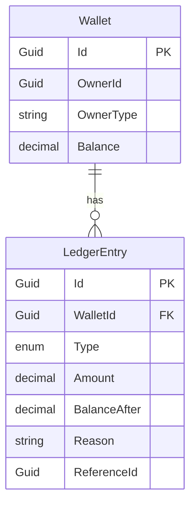

The `ReferenceId` (order/withdrawal id) is what makes crediting idempotent — one credit per source event, ever.

## StoreOrders DB — ER

`StoreOrdersDbContext` · the richest schema — catalog (Store → StoreProduct), orders (StoreOrder → StoreOrderItem), and a per-store settlement ledger (StoreWallet → StoreWalletEntry).

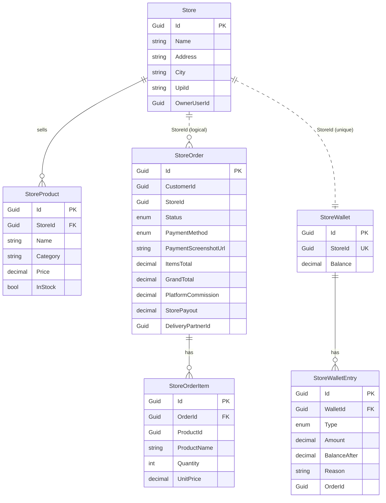

## Partner DB — ER

`PartnerDbContext` · Partner (unique UserId), pharmacy Inventory, and AvailableOrder — a projection of open orders fed by `OrderCreatedEvent` and claimed atomically.

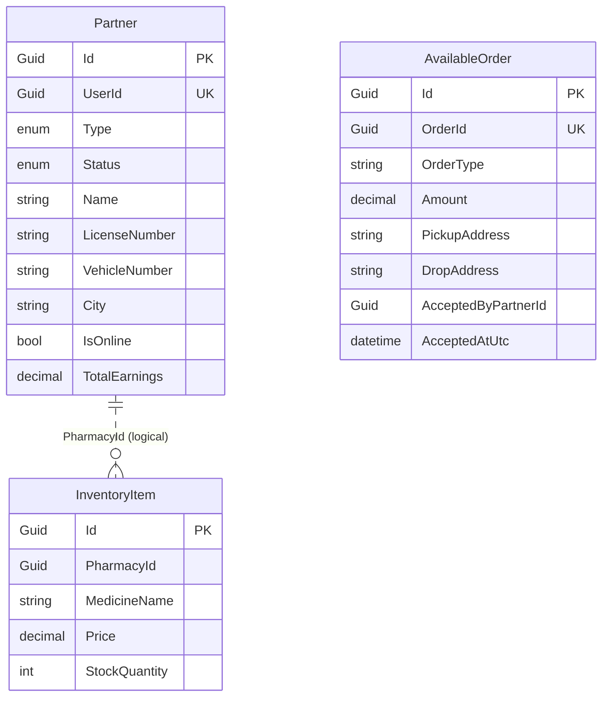

## CyberCafe DB — ER

`CyberCafeDbContext` · an appointment has many session files (metadata only — blobs live in object storage, referenced by URL).

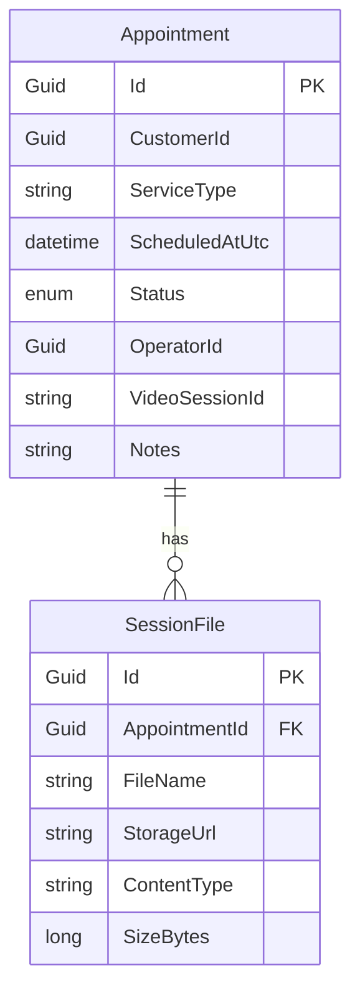

## Analytics DB — ER

`AnalyticsDbContext` · a single read-optimized rollup table, unique on (Date, Metric), incremented via a concurrency-safe upsert.

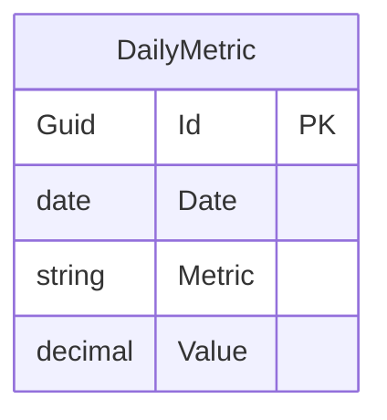

**Notification service has no database** — it is stateless. It consumes `NotificationRequestedEvent` and dispatches through a Strategy of channels (Email/SMS/Push/WhatsApp), so it has no ER diagram.

---

*Generated from the actual `ojas2005/Localllll` source · diagrams render natively on GitHub via Mermaid.*
